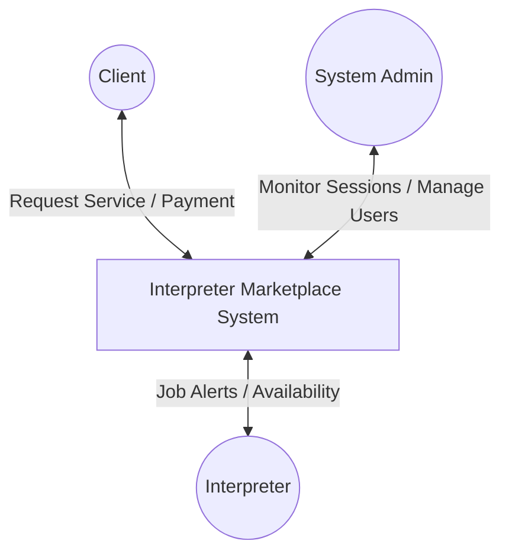
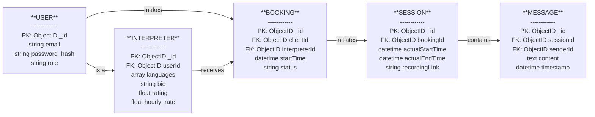
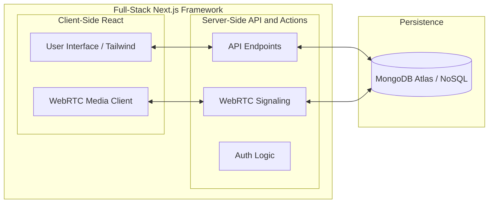
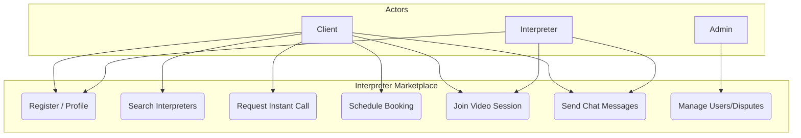
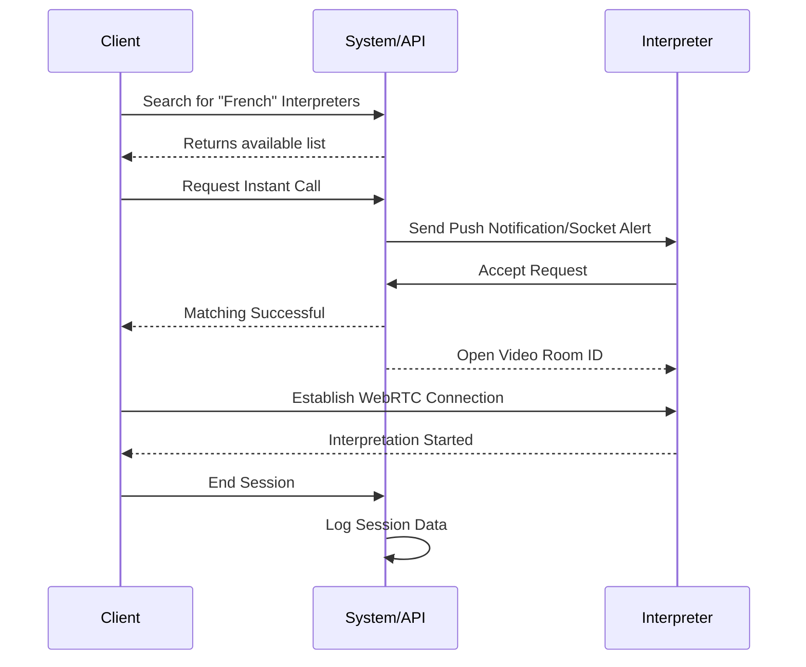
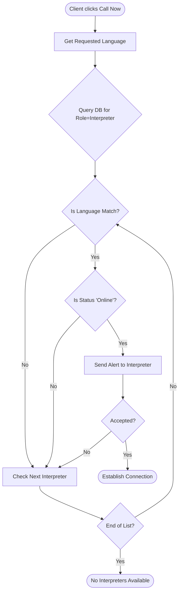

# Project Diagrams for Interpreter Marketplace

## 1. Context Diagram (Level 0 DFD)
This diagram shows the system as a single process and its interactions with external entities.

---

## 2. NoSQL Schema (Logical ERD)
While MongoDB is schema-less, the following logical relationships are maintained between collections. (Rendered as a left-to-right diagram to enforce a balanced layout).

---

## 3. System Architecture
This diagram shows the technology stack and how the components communicate.

---

## 4. Use Case Diagram
This diagram shows the high-level functionality available to each user type.

---

## 5. Sequence Diagram (UML)
This diagram shows the step-by-step process of a real-time interpretation request.

---

## 6. Matching Algorithm Flowchart
This illustrates the logic used to pair a client with the correct interpreter.

---

# Final Pre-Conversion Checklist
Before you convert your Markdown to Word, ensure you have done the following:

1.  **Fill Placeholders**: Search for `[USER NAME]`, `[REG. No]`, and `[SUPERVISOR NAME]` in the report and replace them with your actual details.
2.  **Generate TOC**: If you use Word, delete the manual Table of Contents I wrote and use Word's **References > Table of Contents** so it has clickable page numbers.
3.  **Insert Figures**:
    -   Copy the Mermaid code from this file into the [Mermaid Live Editor](https://mermaid.live/).
    -   Download the diagrams as PNG/SVG.i have about 6 
    -   Insert them into the corresponding sections of your Word document.
4.  **Check Page Breaks**: Ensure the "Declaration," "Abstract," and "Chapter 1" each start on a fresh page.
5.  **Alignment**: In Word, select all text (Ctrl+A) and use **Justify** alignment as per the MMU guideline.
